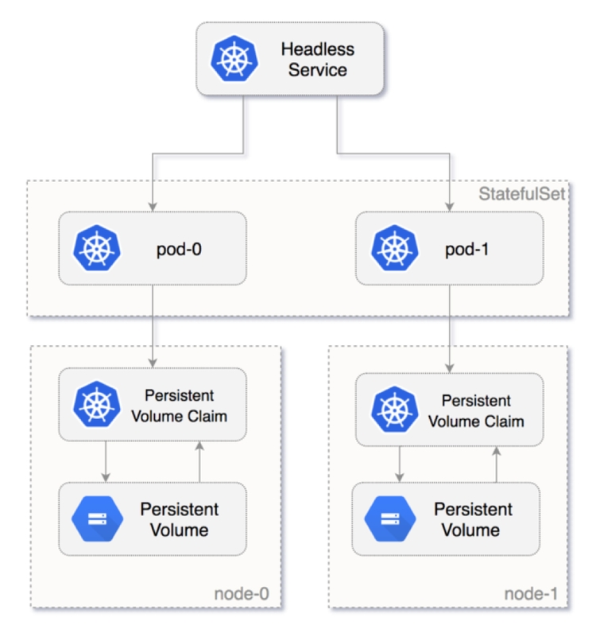
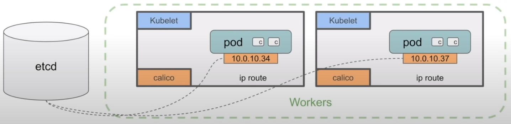

# Mini Curso k8s


### Fuentes

- **PeladoNerd** - [Canal YouTube](https://www.youtube.com/channel/UCrBzBOMcUVV8ryyAU_c6P5g)
    - **Video** [KUBERNETES 2021 - De NOVATO a PRO! (CURSO COMPLETO)](https://www.youtube.com/watch?v=DCoBcpOA7W4)

**Documentacion oficial de k8s: [AQUI](https://kubernetes.io/es/)**

**Review de la api de k8s: [AQUI](https://kubernetes.io/docs/reference/generated/kubernetes-api/v1.22/#-strong-api-overview-strong-)**

## Herramientas esenciales

### Instalar `kubectl` [link](https://kubernetes.io/docs/tasks/tools/)

<details>
  <summary>En linux</summary>

Descargar el binario

  ```bash
  curl -LO "https://dl.k8s.io/release/$(curl -L -s https://dl.k8s.io/release/stable.txt)/bin/linux/amd64/kubectl"
  ```

Instalar

  ```bash
  sudo install -o root -g root -m 0755 kubectl /usr/local/bin/kubectl
  ```

Comprobar

  ```bash
  kubectl version --client --output=yaml
  ```

  <details>
    <summary>Salida</summary>

  ```bash
  clientVersion:
    buildDate: "2022-03-16T15:58:47Z"
    compiler: gc
    gitCommit: c285e781331a3785a7f436042c65c5641ce8a9e9
    gitTreeState: clean
    gitVersion: v1.23.5
    goVersion: go1.17.8
    major: "1"
    minor: "23"
    platform: linux/amd64
  ```

  </details>
</details>

### Instalar `Minikube` [link](https://minikube.sigs.k8s.io/docs/start/)

<details>
  <summary>En linux</summary>

Descargar el binario

  ```bash
  curl -LO https://storage.googleapis.com/minikube/releases/latest/minikube-linux-amd64
  ```

Instalar

  ```bash
  sudo install minikube-linux-amd64 /usr/local/bin/minikube
  ```

Comprobar

  ```bash
  minikube version
  ```

  <details>
    <summary>Salida</summary>

  ```bash
  minikube version: v1.25.2
  commit: 362d5fdc0a3dbee389b3d3f1034e8023e72bd3a7
  ```

  </details>
</details>

## Otras herramientas interesantes para chequear

### Instalar `kubecolor` [link](https://github.com/hidetatz/kubecolor/releases)

<details>
  <summary>En linux</summary>

- Descargar el binario - [link](https://github.com/hidetatz/kubecolor/releases)
- Descomprimir el binario

```bash
curl -LO https://github.com/hidetatz/kubecolor/releases/download/v0.0.20/kubecolor_0.0.20_Linux_x86_64.tar.gz
tar -xf kubecolor_0.0.20_Linux_x86_64.tar.gz kubecolor
```

**Instalar**

```bash
sudo install kubecolor /usr/local/bin/kubecolor
```

**Comprobar**

```bash
kubecolor version
```

  <details>
    <summary>Salida</summary>

  ```bash
  Client Version: version.Info{Major:"1", Minor:"23", GitVersion:"v1.23.5", GitCommit:"c285e781331a3785a7f436042c65c5641ce8a9e9", GitTreeState:"clean", BuildDate:"2022-03-16T15:58:47Z", GoVersion:"go1.17.8", Compiler:"gc", Platform:"linux/amd64"}
  ```

  </details>

**Configurar**

En el fichero del profile para la terminal (ejemplo: `~/.bashrc`) poner el alias

  ```bash
  alias kubectl="kubecolor"
  ```

</details>

### **Lens Desktop** - Un IDE para k8s - **[Link](https://k8slens.dev/desktop.html)**

<details>
  <summary>En linux</summary>

- Descargar el binario - [link](https://k8slens.dev/desktop.html)

```bash
curl -LO https://api.k8slens.dev/binaries/Lens-5.4.6-latest.20220428.1.amd64.deb
```

**Instalar**

```bash
sudo dpkg -i Lens-5.4.6-latest.20220428.1.amd64.deb
```

**Comprobar**

```bash
lens --version 
```

</details>

## Manos a la obra

Montar el cluster en local con `minikube`

La idea es montar un cluster en local y poder jugar con él aprendiendo los conceptos base. Para esto usaremos `minikube` 
y como interfase con el cluster usaremos `kubectl`.

```bash
minikube start
```

Este comando crea un cluster en local con el que podemos jugar, por defecto monta una máquina virtual con 2 cpus 
y 8 Gb de ram.

```bash
minikube dashboard
```

Con este comando abre en el navegador un dashboard web que está instalado por defecto en nuestro `minikube` para 
interactuar con el cluster y obtener informacion de nuestro cluster.


```bash
minikube addons list
```

Lista todos los addons disponibles para `minikube` y podemos ver cuáles son los que están habilitados.

<details>
  <summary>Salida</summary>

```text
|-----------------------------|----------|--------------|--------------------------------|
|         ADDON NAME          | PROFILE  |    STATUS    |           MAINTAINER           |
|-----------------------------|----------|--------------|--------------------------------|
| ambassador                  | minikube | disabled     | third-party (ambassador)       |
| auto-pause                  | minikube | disabled     | google                         |
| csi-hostpath-driver         | minikube | disabled     | kubernetes                     |
| dashboard                   | minikube | enabled ✅   | kubernetes                     |
...
```

</details>

### Conceptos basicos de Kubernetes

### [Namespaces](https://kubernetes.io/es/docs/concepts/overview/working-with-objects/namespaces/)
Kubernetes soporta múltiples clústeres virtuales respaldados por el mismo clúster físico. Estos clústeres virtuales se 
denominan namespaces. Puedes separar de forma logica las cargas de trabajo dentro del cluster. 
Existe algunos namespaces por defecto `default` por ejemplo.


```bash
kubectl get namespaces
```

<details>
  <summary>Salida</summary>

```text
NAME                   STATUS   AGE
default                Active   47h
kube-node-lease        Active   47h
kube-public            Active   47h
kube-system            Active   47h
kubernetes-dashboard   Active   47h
```
</details>

Manifiesto de un namespace

```yaml
apiVersion: v1
kind: Namespace
metadata:
  name: simple-namespace
```

Crear un namespace

```bash
kubectl apply -f ./files/simple-namespace.yaml
```

Borrar un namespace

```bash
kubectl delete namespace simple-namespace
```

___

### [Pods](https://kubernetes.io/docs/concepts/workloads/pods/)
Son las unidades más pequeñas que se pueden desplegar en k8s, es la forma que tiene k8s de agrupar uno o varios 
contenedores para las cargas de trabajo. Dentro de un pod pueden existir varios container, también 
se les pueden adjuntar volumenes o volumenes persistentes. Los contenedores dentro del pod comparten IP y dentro del pod 
la comunicación entre contenedores puedes realizarla con `localhost`.

```bash
kubectl get pod
```

<details>
  <summary>Salida</summary>

```text
NAME                     READY   STATUS    RESTARTS   AGE
nginx-85b98978db-hjf68   1/1     Running   0          55m
```
</details>

Comando crear pod
```bash
kubectl apply -f ./files/simple-pod.yaml
```
Comando estado del pod
```bash
kubectl get pod simple-pod -o wide
```
Comando borrar pod
```bash
kubectl delete pod simple-pod
```

<details>
  <summary>Manifiesto de un pod</summary>

```yaml
apiVersion: v1
kind: Pod
metadata:
  name: simple-pod
spec:
  containers:
  - name: nginx
    image: nginx:alpine
```
</details>

___

### [Deployment](https://kubernetes.io/es/docs/concepts/workloads/controllers/deployment/)
Es un tipo de controlador de k8s, es la unidad de más alto nivel que podemos gestionar en k8s. Nos permite definir 
diferentes funciones:

- Control de réplicas
- Escalabilidad de pods
- Actualizaciones continuas
- Despliegues automáticos
- Rollback a versiones anteriores

La idea es manejar las cargas de trabajo basándonos en este controlador. Podemos definir el estado deseado y 
el agente `kubelet` se encarga de mantenerlo asi siempre

```bash
kubectl get deployment
```

<details>
  <summary>Salida</summary>

```text
NAME    READY   UP-TO-DATE   AVAILABLE   AGE
nginx   1/1     1            1           65m
```
</details>

Ejemplo de manifiesto para un deployment

<details>
  <summary>Manifiesto</summary>

```yaml
apiVersion: apps/v1
kind: Deployment
metadata:
  name: nginx-deployment
spec:
  selector:
    matchLabels:
      app: nginx
  replicas: 2
  template:
    metadata:
      labels:
        app: nginx
    spec:
      containers:
      - name: nginx
        image: nginx:alpine
        resources:
          requests:
            memory: "64Mi"
            cpu: "200m"
          limits:
            memory: "128Mi"
            cpu: "500m"
        readinessProbe:
          httpGet:
            path: /
            port: 80
          initialDelaySeconds: 5
          periodSeconds: 10
        livenessProbe:
          tcpSocket:
            port: 80
          initialDelaySeconds: 15
          periodSeconds: 20
        ports:
        - containerPort: 80
```
</details>

Crear deployment
```bash
kubectl apply -f ./files/simple-deployment.yaml
```
Estado del deployment
```bash
kubectl get deployment nginx-deployment
```
Borrar deployment
```bash
kubectl delete deployment nginx-deployment
```
___
### [Daemonset](https://kubernetes.io/docs/concepts/workloads/controllers/daemonset/)
Es otro tipo de controlador de k8s y muy similar al deployment, pero no tiene réplicas, este controlador lo que hace es 
desplegar un pod por cada nodo que tenga el cluster, los casos de uso más frecuentes son:

- Monitoreo de los nodos del cluster
- Recolección de logs de los nodos del cluster

```bash
kubectl get daemonset
```

<details>
  <summary>Salida</summary>

```text
NAME               DESIRED   CURRENT   READY   UP-TO-DATE   AVAILABLE   NODE SELECTOR   AGE
nginx-deployment   1         1         0       1            0           <none>          4s
```
</details>

Ejemplo de manifiesto para un daemonset

<details>
  <summary>Manifiesto</summary>

```yaml
apiVersion: apps/v1
kind: DaemonSet
metadata:
  name: nginx-deployment
spec:
  selector:
    matchLabels:
      app: nginx
  template:
    metadata:
      labels:
        app: nginx
    spec:
      containers:
      - name: nginx
        image: nginx:alpine
        resources:
          requests:
            memory: "64Mi"
            cpu: "200m"
          limits:
            memory: "128Mi"
            cpu: "500m"
        readinessProbe:
          httpGet:
            path: /
            port: 80
          initialDelaySeconds: 5
          periodSeconds: 10
        livenessProbe:
          tcpSocket:
            port: 80
          initialDelaySeconds: 15
          periodSeconds: 20
        ports:
        - containerPort: 80
```
</details>

Crear daemonset
```bash
kubectl apply -f ./files/simple-daemonset.yaml
```
Estado del daemonset
```bash
kubectl get daemonset nginx-daemonset
```
Borrar daemonset
```bash
kubectl delete daemonset nginx-daemonset
```

___
### [Statefulset](https://kubernetes.io/es/docs/concepts/workloads/controllers/statefulset/)
También es una forma de crear pods, pero con un volumen asociado para mantener el estado, es decir que es como un deployment 
en el que cada pod tiene asociado un volumen de almacenamiento unico por pod en donde el pod y solo ese pod lo usa para 
mantener su estado, si el pod muere se crea otro pod y automáticamente este volumen se asocia al nuevo pod.



```bash
kubectl get statefulset
```

<details>
  <summary>Salida</summary>

```bash
NAME               DESIRED   CURRENT   READY   UP-TO-DATE   AVAILABLE   NODE SELECTOR   AGE
nginx-deployment   1         1         0       1            0           <none>          4s
```
</details>

Ejemplo de manifiesto para un daemonset

<details>
  <summary>Manifiesto</summary>

```yaml
apiVersion: apps/v1
kind: StatefulSet
metadata:
  name: simple-statefulset
spec:
  serviceName: nginx
  replicas: 1
  selector:
    matchLabels:
      app: nginx
  template:
    metadata:
      labels:
        app: nginx
    spec:
      containers:
        - name: nginx
          image: k8s.gcr.io/nginx-slim:0.8
          ports:
            - containerPort: 80
              name: web
          volumeMounts:
            - name: www
              mountPath: /usr/share/nginx/html
  volumeClaimTemplates:
    - metadata:
        name: www
      spec:
        accessModes: [ "ReadWriteOnce" ]
        resources:
          requests:
            storage: 1Gi
```
</details>

Crear statefulset
```bash
kubectl apply -f ./files/simple-statefulset.yaml
```
Estado del statefulset
```bash
kubectl get statefulset simple-statefulset
```
Borrar statefulset
```bash
kubectl delete statefulset simple-statefulset
```
____
## [Networking en k8s](https://kubernetes.io/docs/concepts/services-networking/)

Las comunicaciónes entre aplicaciones esta a la orden del dia, y es muy difícil encontrar una aplicacion hoy por hoy 
que no necesite comunicarse con el entorno que le rodea. Esto no es distinto dentro de un cluster, es más, de primeras
complica más las cosas porque k8s va de compartir instancias o nodos entre cargas de trabajos, donde los pods pueden 
estar desplegados en distintos nodos y aun asi tiene que mantener la comunicación.

En esta parte de la [documentacion oficial](https://kubernetes.io/docs/concepts/services-networking/) puedes tener más 
detalle.



En la imagen de arriba hay varias cosas que tenemos que tener en cuenta

- Las ip de los nodos es distinta a la ip de los pods.
- Cada pod tiene una IP.
- Los containers dentro de un pod comparten la ip del pod que los contiene.
- `etcd` es la base de datos de k8s y es donde se almacena y comparte el estado del cluster entre los nodos.
- Los `CNI` o **Container network interface**, son agentes que corren en todos los nodos (workers en la imagen) en este caso 
`calico`
  - `calico` en un CNI que se encarga del manejo de las redes en el cluster, existen otros tipos de CNI, [aqui](https://kubernetes.io/docs/concepts/cluster-administration/networking/#calico) los puedes conocer.
- Las `route-tables` creadas por el agente de CNI en el caso de la imagen `calico`.
- Toda la informacion de las `route-tables` se almacena en `etcd`.

En la imagen tenemos dos nodos con un pod en cada uno, si estos pods quieren comunicarse, el agente CNI almacenaria
en `etcd` las `route-tables` para se pueda establecer la comunicación entre pods, cuando se crea un pod una de las 
primeras cosas que se hace es asignarle una ip, esto lo hace el agente del CNI, se almacena en `etcd`. También se borra 
esta configuración cuando sé borrar el pod, todo esto es trasparente para nosotros y lo hace el agente del CNI.

**Articulos y videos destacados que hablan del tema**

- Video [Desmitificando el networking en Kubernetes - Nerdearla 2018](https://www.youtube.com/watch?v=Q650LveSHy0)
- Video [Container Network Interface (CNI) Simplified | Kubernetes Networking | Pod Security Group](https://www.youtube.com/watch?v=kA0C44nTwjU&t=1042s)
- Doc Oficial k8s [aqui](https://kubernetes.io/docs/concepts/services-networking/)
- [How Kubernetes Networking Works – The Basics](https://blog.neuvector.com/article/kubernetes-networking)
- [Kubernetes (V): networking y políticas de red](https://tangelov.me/posts/kubernetes-v.html#:~:text=Networking%20en%20Kubernetes,del%20proyecto.)
____
### [Services](https://kubernetes.io/es/docs/concepts/services-networking/service/)

Es un objeto de la API de k8s en el que se define como conectarnos a los pods, básicamente un service 
lo que hace es agrupar lógicamente un conjunto de pods y definir una politica de entrada, de esta forma no tenemos que 
conocer la ip de los pods para comunicarnos. Existen distintos tipos de services, estos son los más comunes:

* **ClusterIP**: expone una ip fija en el cluster. (Por defecto)
* **NodePort**: expone un puerto en cada nodo.
* **LoadBalancer**: crea un balanceador de carga (depende del proveedor de cloud que usemos) que redirecciona el tráfico 
a los pods.

#### [Service - Cluster IP](https://kubernetes.io/es/docs/concepts/services-networking/service/#definiendo-un-service) (no recomendado para entornos productivos)

Este service se crea por defecto si no se define la etiqueta `spec.type` en el manifiesto, se mapea 
una ip interna del cluster con la ip de los pods, este mapeo se realiza con la definicion de un selector el cual debe 
estar presente en el manifiesto del service y del deployment, asi el service puede identificar y agrupar las ips 
de los pods para que puedan ser alcanzadas por la ip del cluster cuando hacemos una petition a esta.

<details>
  <summary>Manifiesto de un service Cluster IP</summary>

```yaml
# Manifiesto del service
apiVersion: v1
kind: Service
metadata:
  name: service-cluster-ip
spec:
  ports:
    - port: 80
      targetPort: 8080
  selector:
    role: role-cluster-ip <<< SELECTOR
```

```yaml
# Manifiesto del deployment
...
spec:
  replicas: 3
  selector:
    matchLabels:
      role: role-cluster-ip <<< SELECTOR
...
```

</details>

Aplicar un deployment + service de tipo Cluster IP
```bash
kubectl apply -f "./files/service-cluster-ip.yaml"
```

Listar todo el cluster
```bash
kubectl get all -o wide
```

Si listamos todo el cluster podemos ver que estarían los pods creados por el deployment `pod/app-service-cluster-ip...` 
como también el service `service/service-cluster-ip` que estaba en el deployment 
(pudimos declarar el service en un manifiesto aparte también)

```text
NAME                                          READY   STATUS    RESTARTS   AGE   IP           NODE       NOMINATED NODE   READINESS GATES
pod/app-service-cluster-ip-67cd8b5645-4tgr4   1/1     Running   0          20s   172.17.0.7   minikube   <none>           <none>
pod/app-service-cluster-ip-67cd8b5645-9dxsw   1/1     Running   0          20s   172.17.0.5   minikube   <none>           <none>
pod/app-service-cluster-ip-67cd8b5645-sxxrj   1/1     Running   0          20s   172.17.0.6   minikube   <none>           <none>

NAME                         TYPE        CLUSTER-IP     EXTERNAL-IP   PORT(S)    AGE     SELECTOR
service/kubernetes           ClusterIP   10.96.0.1      <none>        443/TCP    5d19h   <none>
service/service-cluster-ip   ClusterIP   10.99.100.91   <none>        8080/TCP   20s     role=role-cluster-ip
```

Si describimos el service podemos encontrar más information 

```bash
kubectl describe service service-cluster-ip
```

<details>
  <summary>Salida</summary>

```yaml
Name:              service-cluster-ip
Namespace:         default
Labels:            <none>
Annotations:       <none>
Selector:          role=role-cluster-ip
Type:              ClusterIP
IP Family Policy:  SingleStack
IP Families:       IPv4
IP:                10.99.100.91
IPs:               10.99.100.91
Port:              <unset>  80/TCP
TargetPort:        8080/TCP
Endpoints:         172.17.0.5:8080,172.17.0.6:8080,172.17.0.7:8080
Session Affinity:  None
Events:            <none>
```
</details>

Para hacer peticiones a los pods solo podemos hacerlo desde dentro del cluster, para esto aplicamos un deployment con 
un pod. Desde ahi podemos hacer peticiones en a los pods de la app.

```bash
kubectl apply -f ./file/bastion.yaml
```

Nos metemos dentro del pod `bastion`

```bash
kubectl exec -it bastion -- sh
```

Con la terminal dentro del pod podemos hacer un `curl [ip service]:[port service]` y ver la respuesta de los pods, 
el service debería de balancear las peticiones entre los distintos pods.

```bash
curl 10.99.100.91:80
```
```bash
Hello, world!
Version: 1.0.0
Hostname: app-service-cluster-ip-67cd8b5645-sxxrj
```

También podemos hacer un `curl` al nombre del service `service-cluster-ip`

```bash
curl http://service-cluster-ip
```
```bash
Hello, world!
Version: 1.0.0
Hostname: app-service-cluster-ip-67cd8b5645-478tb
```

#### [Service - Node Port](https://kubernetes.io/es/docs/concepts/services-networking/service/#tipo-nodeport)

Este service expone un puerto en cada uno de los nodos del cluster y mapea el tráfico de ese puerto al service que 
agrupa los pods de nuestra aplicacion.

<details>
  <summary>Manifiesto de un service Node Port</summary>

Nótese que a diferencia del manifiesto de cluster ip, node port tiene que tener `spec.type` igual a `NodePort` y para 
crear el puerto en cada uno de los nodos y que quede expuesto también la etiqueta `spec.ports[].nodePort` con el número 
del puerto que queremos exponer.

```yaml
apiVersion: v1
kind: Service
metadata:
  name: service-node-port
spec:
  type: NodePort
  ports:
    - port: 80
      targetPort: 8080
      nodePort: 30000
  selector:
    role: role-node-port <<< SELECTOR
```

</details>

Aplicar un deployment + service de tipo Node Port
```bash
kubectl apply -f "./files/service-node-port.yaml"
```

Ahora si queremos conectarnos por el service a los pods de la aplicacion debemos conocer la ip de los nodos del cluster

```bash
kubectl get nodes -o wide
```
```bash
NAME       STATUS   ROLES                  AGE     VERSION   INTERNAL-IP    EXTERNAL-IP   OS-IMAGE             KERNEL-VERSION      CONTAINER-RUNTIME
minikube   Ready    control-plane,master   5d21h   v1.23.3   192.168.49.2   <none>        Ubuntu 20.04.2 LTS   5.15.0-33-generic   docker://20.10.12
```


También si usas `minikube` puedes correr el siguiente comando, devuelve la ip del nodo con el puerto del service que 
configuramos en el manifiesto. Puedes acceder desde el navegador o haciendo un `curl`.

```bash
minikube service service-node-port --url
___
http://192.168.49.2:30000
```

#### [Service - LoadBalancer](https://kubernetes.io/es/docs/concepts/services-networking/service/#loadbalancer)

En este caso dependiendo de donde este montado el cluster cuando creamos un service de tipo load balancer crea algo similar 
a un node port, pero pone delante un loadbalancer para hacer de punto unico de entrada para los pods, si estamos en la nube
creara un balanceador segun el proveedor de nube, en el caso de `minikube` se debe tener abierto una terminal corriendo 
un comando para que el service pueda tomar una ip y exponer los pods de la aplicacion.

<details>
  <summary>Manifiesto de un service Load Balancer</summary>

```yaml
apiVersion: v1
kind: Service
metadata:
  name: service-load-balancer
spec:
  type: LoadBalancer
  ports:
    - port: 80
      targetPort: 8080
      nodePort: 30000
  selector:
    role: role-load-balancer <<< SELECTOR
```

Si no configuramos la propiedad `spec.ports[].nodePort` k8s nos provee de un puerto que va desde **30000** al **32767**.

</details>

Para crear un service de este tipo con `minikube`:

En una termina aparte ejecutamos el siguiente comando para levantar un `tunnel` y poder conectar al loadbalancer, dejaremos
el comando ejecutando sin cerrar la terminal

```bash
minikube tunnel
```

<details>
  <summary>Salida</summary>

```bash
...
Status: 
    machine: minikube
    pid: 125254
    route: 10.96.0.0/12 -> 192.168.49.2
    minikube: Running
    services: [service-load-balancer]
errors: 
    minikube: no errors
    router: no errors
    loadbalancer emulator: no errors
...
```
</details>

Aplicar el deployment en otra terminal

```bash
kubectl -apply -f ./files/service-load-balancer.yaml
```

Ahora si vemos que tenemos desplegado en el cluster deberíamos tener algo similar a esto

```bash
kubectl get all -o wide
```

```text
NAME                                             READY   STATUS    RESTARTS   AGE   IP           NODE       NOMINATED NODE   READINESS GATES
pod/app-service-load-balancer-57f56b48c8-7gbjq   1/1     Running   0          7s    172.17.0.7   minikube   <none>           <none>
pod/app-service-load-balancer-57f56b48c8-f6sbq   1/1     Running   0          7s    172.17.0.4   minikube   <none>           <none>
pod/app-service-load-balancer-57f56b48c8-p6mzq   1/1     Running   0          7s    172.17.0.3   minikube   <none>           <none>

NAME                            TYPE           CLUSTER-IP       EXTERNAL-IP      PORT(S)        AGE    SELECTOR
service/kubernetes              ClusterIP      10.96.0.1        <none>           443/TCP        6d1h   <none>
service/service-load-balancer   LoadBalancer   10.105.169.212   10.105.169.212   80:30000/TCP   7s     role=role-load-balancer
```

Si copiamos la **Ip** externa del `service/service-load-balancer` y la abrimos en un navegador o hacemos un curl desde 
consola deberíamos poder llagar a los pods y balancear sobre ellos con distintas respuestas.

```bash
curl http://10.105.169.212
```
```bash
Hello, world!
Version: 1.0.0
Hostname: app-service-load-balancer-57f56b48c8-f6sbq
```

## [Ingress](https://kubernetes.io/docs/concepts/services-networking/ingress/)

Es un tipo de controlador que permite al acceso a nuestras aplicaciones en k8s comunicarse con el exterior como unico 
punto de entrada, en donde podemos apuntar a distintas aplicaciones o deployments definiendo por ejemplo distintos paths
en la url o reglas en el manifiesto del ingress. 

Podemos decir que los ingress son una pieza externa y que debemos instalarla en el cluster, existen varios proveedores, 
dependiendo la naturaleza de nuestro cluster podremos usar uno u otro, en este [enlace](https://kubernetes.io/docs/concepts/services-networking/ingress-controllers/) 
pueden ver algunos.

Un ingress debería ser capas de balancear carga en nuestras aplicaciones como también manejar conexiones SSL/TLS, 
la configuración puede variar segun el proveedor del ingress controler.


En la imagen se aprecia como funciona el acceso de un ingress a nuestras aplicaciones, el cliente hace una 
peticion al ingress el cual evalua las reglas de enrutamiento definidas en el manifiesto, estas reglas tienen asociado un
`service` el cual a su vez tiene como target los pods del deployment de nuestras aplicacions. 

Asi desde un unico punto de entrada se pueden hacer peticiones a distintas aplicaciones, con los services no podríamos hacer esto. 

Manifiesto para un ingress

```yaml
apiVersion: networking.k8s.io/v1
kind: Ingress
metadata:
  name: hello-app
spec:
  rules:
  - http:
      paths:
      - path: /v1
        pathType: Prefix
        backend:
          service:
            name: hello-v1
            port:
              number: 8080
      - path: /v2
        pathType: Prefix
        backend:
          service:
            name: hello-v2
            port:
              number: 8080
```

En la propiedad `spec.rules[].http.paths[]` es donde declaramos las distintas reglas para una conexion en este caso 
del tipo http.

Para `minikube` vamos a habilitar el ingress en los addons

```bash
minikube addons enable ingress
```

Verificamos que esta todo correcto

```bash
kubectl get pods -n ingress-nginx
```

```bash
NAME                                       READY   STATUS      RESTARTS   AGE
ingress-nginx-admission-create-h9nvg       0/1     Completed   0          94s
ingress-nginx-admission-patch-4vk7d        0/1     Completed   1          94s
ingress-nginx-controller-cc8496874-lslb5   1/1     Running     0          94s
```

Aplicar el deployment con las dos aplicaciones y los dos services

```bash
kubectl apply -f files/deployment-for-ingress.yaml
```

Aplicar el controlador ingress que hagan target a los dos services creados

```bash
kubectl apply -f ./files/simple-ingress.yaml
```

Ahora podemos verificar el ingress y las reglas con este comando

```bash
kubectl describe ingress simple-ingress
```
```bash
Name:             simple-ingress
Labels:           <none>
Namespace:        default
Address:          192.168.49.2
Ingress Class:    nginx
Default backend:  <default>
Rules:
  Host        Path  Backends
  ----        ----  --------
  *           
              /v1   service-app-v1:8080 (172.17.0.11:8080,172.17.0.3:8080,172.17.0.7:8080)
              /v2   service-app-v2:8080 (172.17.0.10:8080,172.17.0.4:8080,172.17.0.8:8080)
Annotations:  <none>
Events:
  Type    Reason  Age                From                      Message
  ----    ------  ----               ----                      -------
  Normal  Sync    17m (x2 over 18m)  nginx-ingress-controller  Scheduled for sync
```

Ahora con la ip de nuestro cluster podríamos o bien hacer peticiones con el navegador o con `curl` para acceder a 
nuestras aplicaciones

```bash
minikube ip
```

```bash
curl http://http://192.168.49.2/v1
```
```bash
Hello, world!
Version: 1.0.0
Hostname: app-ingress-v1-64b5dffcd8-chbrp
```

```bash
curl http://http://192.168.49.2/v2
```
```bash
Hello, world!
Version: 2.0.0
Hostname: app-ingress-v2-6b68575fd9-jl9fz
```

## [ConfigMaps](https://kubernetes.io/es/docs/concepts/configuration/configmap/)

Este objeto como su nombre lo indica almacena configuraciones que puedan ser consultadas por las aplicaciones, puedes 
leer los configmaps desde un deployment e inyectarlos en los pods como variables de entorno o como un volumen que 
inyecta un fichero de solo lectura para que los containers del pod lo usen.

Manifiesto configmap

```yaml
apiVersion: v1
kind: ConfigMap
metadata:
  name: simple-configmap
data:
  dummy-var: dummy-value
  dummy-file-config: |
    dummy-var=dummy-value
```

<details>
  <summary>Manifiesto del pod</summary>

```yaml
apiVersion: v1
kind: Pod
metadata:
  name: pod-configmaps
spec:
  containers:
    - name: pod-configmaps
      image: alpine/curl
      args:
        - sleep
        - infinity
      env:
        - name: DUMMY_VAR
          valueFrom:
            configMapKeyRef:
              name: simple-configmap
              key: dummy-var
      volumeMounts:
        - name: config
          mountPath: "/config"
          readOnly: true
  volumes:
    - name: config
      configMap:
        name: simple-configmap
        items:
        - key: "dummy-file-config"
          path: "dummy-file-config"
```
</details>

Crear y aplicar un configmap

```bash
kubectl apply -f ./files/simple-configmap.yaml
```

Vamos a usarlo desde un pod con el siguiente manifiesto

```bash
kubectl apply -f ./files/pod-configmaps.yaml
```

Entramos al pod y verificamos las variables de entorno inyectadas y los ficheros en los volumenes

```bash
kubectl exec -it pod-configmaps -- env
```
```bash
...
DUMMY_VAR=dummy-value <<< configuración inyectada
...
```

```bash
kubectl exec -it pod-configmaps -- cat /config/dummy-file-config
```
```text
dummy-var=dummy-value
```

>⚠ Importante saber que si actualizas los valores del configmap, en el pod solo se actualizaran los ficheros del volumen, 
las variables de entorno seguirían siendo iguales. Para actualizar la configuración se debería matar el pod para que 
el deployment cre un pod nuevo y se mapeen los nuevos valores desde el configmap.

>⚠ En caso de crear un pod y no existir él `configmap` saltarán errores y no se podría crear el pod.

```bash
...
MountVolume.SetUp failed for volume "config" : configmap "simple-configmap" not found
...
Error: configmap "simple-configmap" not found
```

## [Secrets](https://kubernetes.io/es/docs/concepts/configuration/secret/)

Con este objeto crearemos secretos que van a poder ser usados por nuestros pod, algo asi como los configmaps, pero 
los valores de las variables esta vez están codificados en `base64`, estos valores son faciles de descodificar y no se
recomienda guardar credenciales sensibles.

Manifiesto

```yaml
apiVersion: v1
kind: Secret
metadata:
  name: simple-secrets
type: Opaque
data:
  username: YWRtaW4=
  password: c3VwM3JwYXNzdzByZAo=
```

Crear un secret desde un manifiesto

```bash
kubectl apply -f ./files/simple-secrets.yaml
```

También podemos crear el secret con kubectl con el siguiente comando

```bash
kubectl create secret generic simple-secrets \
  --from-literal=username=admin \
  --from-literal=password=superpassword
```

<details>
  <summary>Manifiesto del pod consumiendo secrets</summary>

```yaml
apiVersion: v1
kind: Pod
metadata:
  name: pod-secrets
spec:
  containers:
    - name: pod-secrets
      image: alpine/curl
      args:
        - sleep
        - infinity
      env:
        - name: USERNAME
          valueFrom:
            secretMapKeyRef:
              name: simple-secrets
              key: username
        - name: PASSWORD
            valueFrom:
              secretMapKeyRef:
                name: simple-secrets
                key: password
```
</details>

Crear pod que lee los secrets

```bash
kubectl apply -f ./files/pod-secrets.yaml
```

Verificar si las variables de entorno están dentro del pod

```bash
kubectl exec -it pod-secrets -- env
```